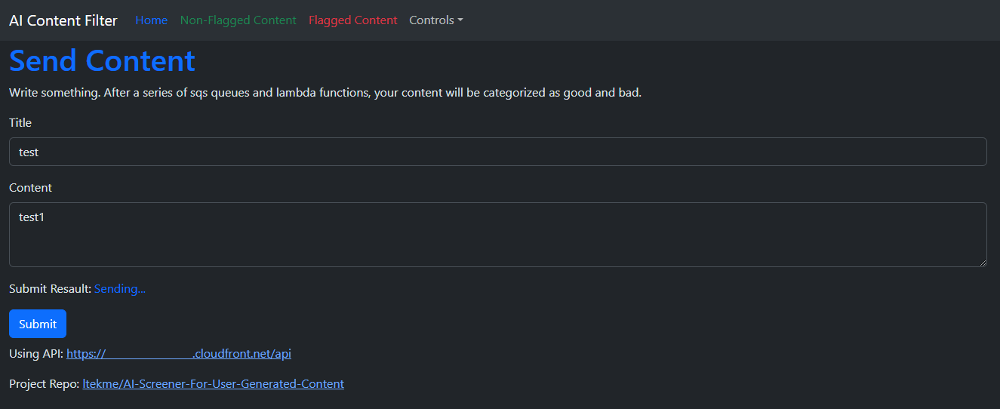
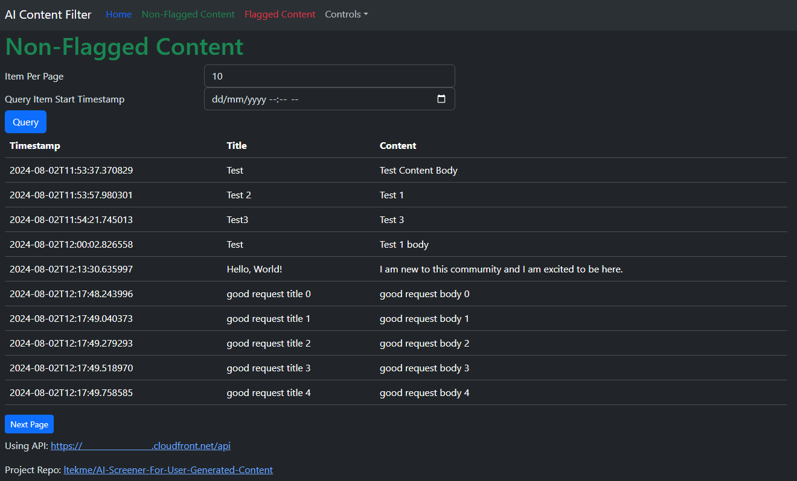
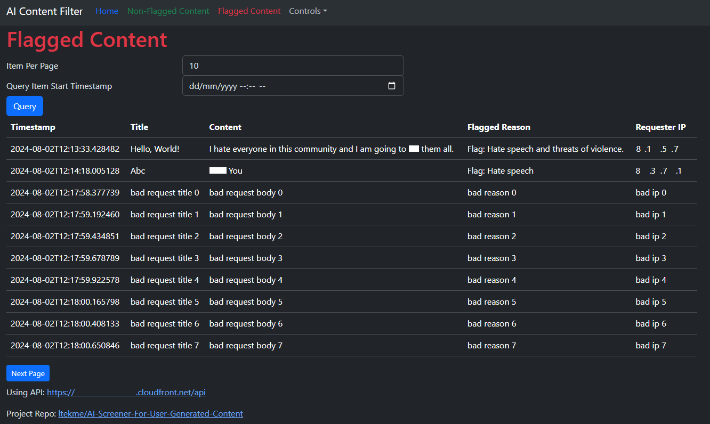
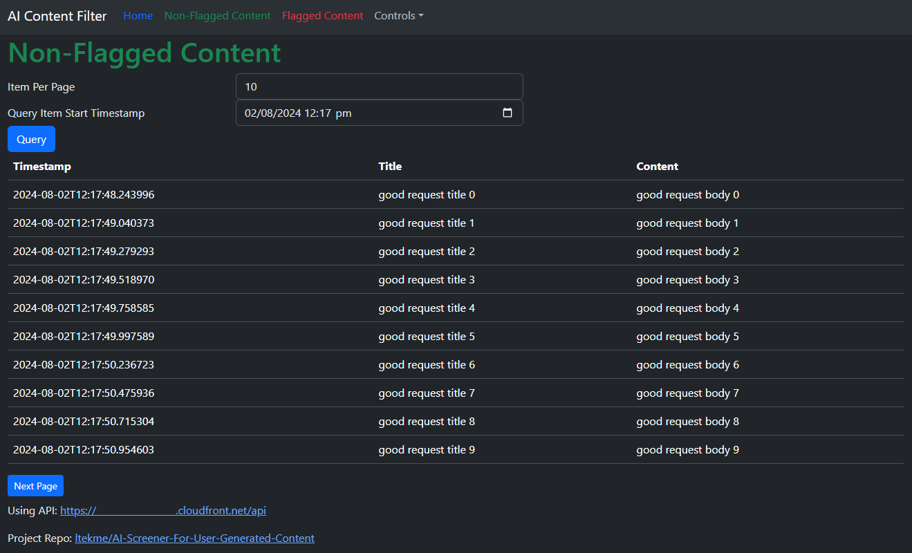

# Using the Web Interface

[↩️ go back](../README.md)

## Table of contents

- [Using the Web Interface](#using-the-web-interface)
  - [Table of contents](#table-of-contents)
  - [Accessing Web Interface](#accessing-web-interface)
  - [Submiting Content](#submiting-content)
  - [Viewing Content](#viewing-content)
    - [Vewing Non-Flagged Content](#vewing-non-flagged-content)
    - [Viewing Flagged Content](#viewing-flagged-content)
    - [Querying Non-Flagged/Flagged Content](#querying-non-flaggedflagged-content)
      - [Item per page](#item-per-page)
      - [Query by timestamp](#query-by-timestamp)
  - [Changing Settings](#changing-settings)
    - [Modifying notify subscriber](#modifying-notify-subscriber)
      - [Adding subscriber](#adding-subscriber)
      - [Removing subscriber](#removing-subscriber)
    - [Modifying Settings for Content Flagger](#modifying-settings-for-content-flagger)
      - [Always Flag Content](#always-flag-content)
      - [Bypass Content Flagger](#bypass-content-flagger)
      - [Always Flag Content + Bypass Content Flagger Enabled](#always-flag-content--bypass-content-flagger-enabled)
    - [Changing Theme](#changing-theme)

## Accessing Web Interface

After applying the resources. The output should contains the url for the web interface. like below.

The one in the 2 urls the one with `web-interface-url` are the url for the web interface. Depending on weather the [`use-cloudfront`](/docs/variables.md#web-interface-settings-variables) is `true` or `false`. This url will be s3 website url or cloudfront url.

Open that url on your brower. Be ware that Javascript must be enabled as the frontend is built using [react.js](https://react.dev/).

## Submiting Content

Once the title and body is inputed into the 2 box click the `Submit` button, and the content will be sent to the api. While waiting for the API to respond, A `Submit Resault: Sending` message will pop up.

Once the request is sent and the api respons with no errors. The status message will turn green and change to `Success`.

## Viewing Content

### Vewing Non-Flagged Content

---

Clicking the `Non-Flagged Content` tab at the Navgation bar marked `green` will take you to the page where it will display all content submitted that is not flagged.

### Viewing Flagged Content

---

Clicking the `Flagged Content` tab at the Navgation bar marked `red` will take you to the page where it will display all content submitted that is not flagged.

### Querying Non-Flagged/Flagged Content

---

#### Item per page

---

The first input box changes how many rows of data to display at once. Click the button `Query` to update the resault. Clicking the `Next Page` button would take you to the query resault.

#### Query by timestamp

---

Only submission later then the `Query Item Start Timestamp` will be display if this value is present. Note all timespamp are in UTC [ISO 8601](https://en.wikipedia.org/wiki/ISO_8601) format. Click the button `Query` to update the resault.

## Changing Settings

Clicking the `Controls` item on the navgation bar reviews a dropdown menu.

---

### Modifying notify subscriber

Checking on `Alert Email` in the dropdown menu brings you to the page where you can control what email is subscribed to the sns topic that notify subsribers when a content that is flagged is submitted.

---

#### Adding subscriber

To add subscriber. Type in the email of the subscriber in the input box and click `subscribe`. Before the subscription is confirmed. The web interface should show `Pending Confirmation` for that email and action should be `Nope`. An email that look like the image below should appear in the inbox of the email was typed into the inbox.

Clicking on `Confrm Subscription` should bring you to the page below. Showing the subscription is confirmed.

After the subscription is confirmed, refresh the web interface and `Subscribed` should be showing next to the new email. Next time a content that is flagged is submitted, a copy would be sent to emails in the list. Like below.

---

#### Removing subscriber

To remove a subscriber. Check `Unsubscribe` in the action column for the email you want to unsubscribe. The `State` should change to `Email Unsubscribed Sucessfully`.

After the email is unsubscribed. It will no longer recieve any alery from this sns topic.

---

### Modifying Settings for Content Flagger

From the `controls` dropdown menu, chlick `Content Flagger Paramaters`. After the page loads 2 check box item should appear. To enable each paramater, click the check box and click `Update` to save the changes.

---

#### Always Flag Content

When always flag content is enabled. The AI is bypassed. No matter if the content is safe or not. It will be flagged with a reason of `Always Flag Enabled`.

---

#### Bypass Content Flagger

When `Bypass Content Flagger` is enabled. All content submitted will not be flagged, regardless if the content submitted is safe or not.

---

#### Always Flag Content + Bypass Content Flagger Enabled

When both paramater is enabled. Always Flag Content will overide, `Bypass Content Flagger`. Regardless if the content submitted is safe or not, it will be flagged.

---

### Changing Theme

To change the theme from dark to light. In the drop down menu it should show `Light Mode` when using dark theme and vise versa. Simple chick on `Light Mode` or `Dark Mode` to swich between them. This functionality uses [localstorage](https://developer.mozilla.org/en-US/docs/Web/API/Window/localStorage) to store the current theme, so that when the page refresh the setting is not lost.
