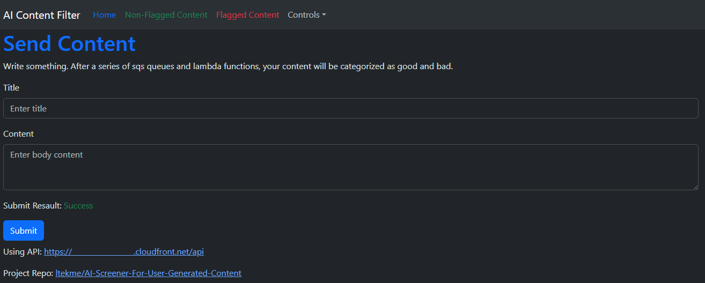

# Using the Web Interface

## Table of contents

- [Using the Web Interface](#using-the-web-interface)
  - [Table of contents](#table-of-contents)
  - [Accessing Web Interface](#accessing-web-interface)
  - [Submiting Content](#submiting-content)
  - [Vewing Non-Flagged Content](#vewing-non-flagged-content)
  - [Viewing Flagged Content](#viewing-flagged-content)

## Accessing Web Interface

After applying the resources. The output should contains the url for the web interface. like below.

The one in the 2 urls the one with `web-interface-url` are the url for the web interface. Depending on weather the [`use-cloudfront`](/docs/variables.md#web-interface-settings-variables) is `true` or `false`. This url will be s3 website url or cloudfront url.

Open that url on your brower. Be ware that Javascript must be enabled as the frontend is built using [react.js](https://react.dev/).

## Submiting Content

Once the title and body is inputed into the 2 box click the `Submit` button, and the content will be sent to the api. While waiting for the API to respond, A `Submit Resault: Sending` message will pop up.

Once the request is sent and the api respons with no errors. The status message will turn green and change to `Success`.

## Vewing Non-Flagged Content

Clicking the `Non-Flagged Content` tab at the Navgation bar marked with a black squre will take you to the page where it will display all content submitted that is not flagged.

In the 2 input box controls how the query is displayed. The first one control how many submission per item and the second one control the datetime which item are displayed. Only submission later then the `Query Item Start Timestamp` will be display if this value is present. Note all timespamp are in UTC [ISO 8601](https://en.wikipedia.org/wiki/ISO_8601) format

After adjusting the 2 input values. Click Query and the table below will be updated. Like so.

## Viewing Flagged Content

Clicking the `Flagged Content` tab at the Navgation bar marked with a black squre will take you to the page where it will display all content submitted that is not flagged.

The 2 input box works the same as the one in the `Non-Flagged Content`.

Apart from that, This page contains the ip of where the content is submitted. And the reason the submission is flagged.
